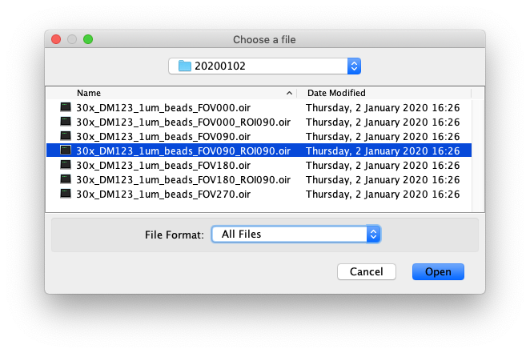
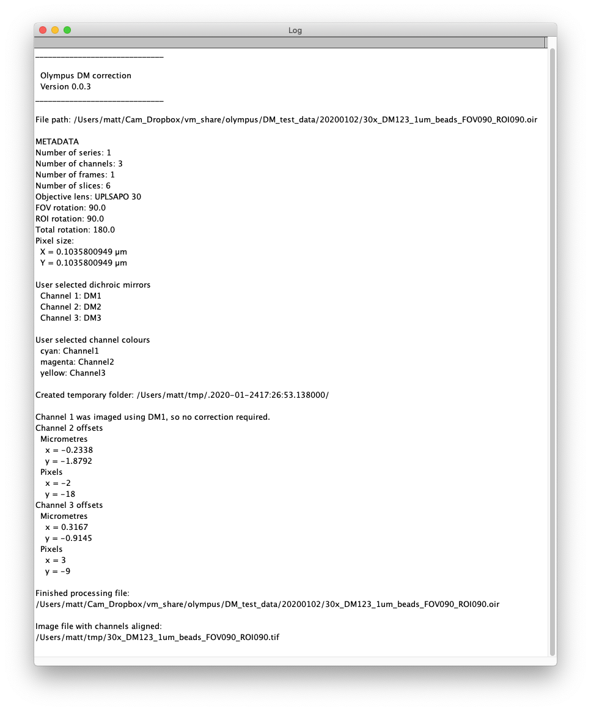
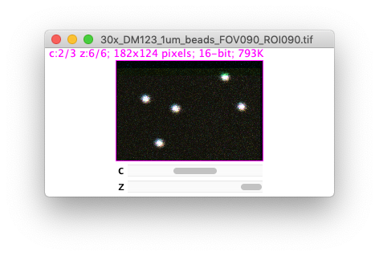

# Olympus DM correction ImageJ/Fiji plugin

**N.B. This plugin requires the BioFormats plugins (https://imagej.net/Bio-Formats)**

[Fiji](https://imagej.net/Fiji) comes with the BioFormats plugins pre-installed. If you are using regular [ImageJ](https://imagej.net) you will need to install the BioFormats plugins (see https://docs.openmicroscopy.org/bio-formats/5.8.2/users/imagej/installing.html).

## Installation
1. Close ImageJ/Fiji

2. Download zip file: [zoo_img_fac_plugins.zip](https://github.com/WaylandM/dichroic-mirror-offsets/blob/master/fiji_plugins/zoo_img_fac_plugins.zip?raw=true)

3. Unzip zoo_img_fac_plugins.zip to the plugins directory of ImageJ/Fiji.

When you restart ImageJ/Fiji you should see **Olympus DM correction** on the plugins menu under **Zoology Imaging Facility**:

## Use

### Example image sequence
To demonstrate usage of the plugin we will take the example of the following fluoresent bead image:

The image comprises 3 channels (captured with DMs 1-3) and six slices. 

### 1. Launch plugin
**Plugins -> Zoology Imaging Facility -> Olympus DM correction**

**N.B. The Olympus oir file doesn't need to be open when you start the plugin. If you have large image files to process it is best not to have any images open in ImageJ/Fiji, to maximize the memory available to the plugin.**

### 2. Choose Olympus oir file 
On starting the plugin you will be prompted to select the Olympus oir file to be processed.

The plugin will not make any changes to the Olympus oir file. The aligned channel images will be output as new tif files.

### 3. Choose output directory
Next you will be prompted to choose the directory into which the aligned channel images should be output.

### 4. Match image channels to DMs
The plugin uses [BioFormats](https://www.openmicroscopy.org/bio-formats/) to extract almost all of the metadata (*e.g.* objective lens, pixel size, rotation of field of view, rotation of region of interest) it needs to process the image file. However, as far as I can tell, BioFormats doesn't report which DM was used to acquire each channel. This means we have to manually match each channel to its DM. Channels are numbered from 1 following the Olympus convention.

When you have matched each channel to its DM, click **OK**. 

**N.B. The plugin does not display images at any stage of processing.**

### 5. Log
Progress is reported in the ImageJ/Fiji log.

The log reports the version of the plugin used along with details of the translation applied to each channel. You may wish to keep the log for your records. Select the log window, then from the ImageJ/Fiji **File** menu choose **Save As...***.

### 6. Inspect output
Go to the directory you selected for output. Within this directory you will find a subdirectory with the same name as your Olympus oir file, but with the *.oir* extension removed:

Inside the subdirectory you will find several tif files, one for each of the channels in your original Olympus oir file.

Open and merge channel images in ImageJ/Fiji. All chanels should be correctly aligned.

## Test data
Image data used to test this plugin is available on figshare:

| Date | DOI |
|---|---|
| 2019-07-25 | ? |
| 2020-01-02 | ? |
