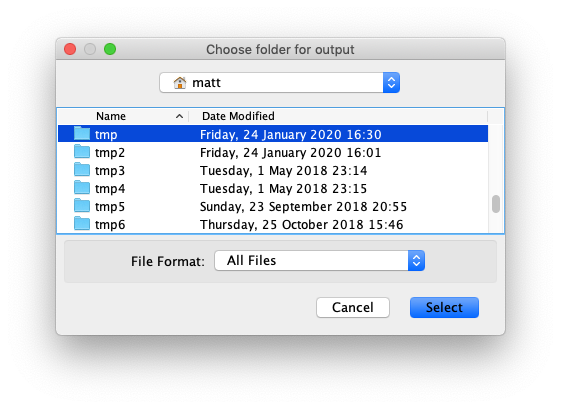
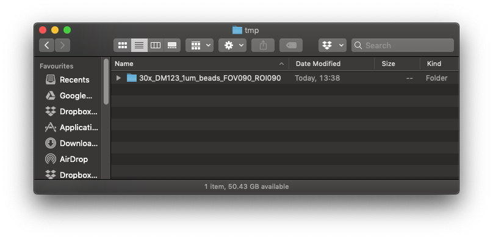

# Olympus DM correction ImageJ/Fiji plugin

**N.B. This plugin requires the BioFormats plugins (https://imagej.net/Bio-Formats)**

[Fiji](https://imagej.net/Fiji) comes with the BioFormats plugins pre-installed. If you are using regular [ImageJ](https://imagej.net) you will need to install the BioFormats plugins (see https://docs.openmicroscopy.org/bio-formats/5.8.2/users/imagej/installing.html).

## Installation
1. Close ImageJ/Fiji

2. Download zip file: [zoo_img_fac_plugins.zip](https://github.com/WaylandM/dichroic-mirror-offsets/blob/master/fiji_plugins/zoo_img_fac_plugins.zip?raw=true)

3. Unzip zoo_img_fac_plugins.zip to the plugins directory of ImageJ/Fiji.

When you restart ImageJ/Fiji you should see **Olympus DM correction** on the plugins menu under **Zoology Imaging Facility**:

## Use

### Example image sequence

### 1. Launch plugin
**Plugins -> Zoology Imaging Facility -> Olympus DM correction**

**N.B. The Olympus oir file doesn't need to be open when you start the plugin. If you have large image files to process it is best not to have any images open in ImageJ/Fiji, to maximize the memory available to the plugin.**

### 2. Choose Olympus oir file 
On starting the plugin you will be prompted to select the Olympus oir file to be processed.

The plugin will not make any changes to the Olympus oir file. The aligned channel images will be output as new tif files.

### 3. Choose output directory
Next you will be prompted to choose the directory into which the aligned channel images should be output.

### 4. Match image channels to 

**N.B. Channels are numbered from 1 following the Olympus convention. **

**File -> Save As...**

## Test data
Image data used to test this plugin is available on figshare:

| Date | DOI |
|---|---|
| 2019-07-25 | ? |
| 2020-01-02 | ? |
